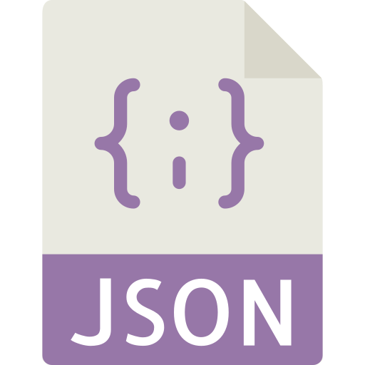

<h1 align=center>Json 2 Dotenv</h1>

# 
> This is a simple code for converting json to dotenv file cli/module

# Documentation

# Quick use

``npx json-to-dotenv``

# Installation

``npm i json-to-dotenv -g ``

# Usage

``json-to-dotenv ./store.json ./.env``

# Example
``json-to-dotenv ./store.json ./.env ``

# Step By Step Usage
this is a wip project and its still in development 

WIP

